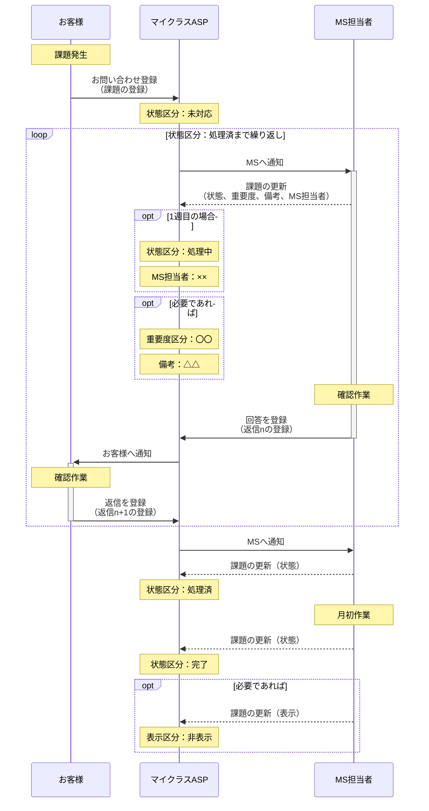

```mermaid
sequenceDiagram
participant user as お客様
participant ASP as マイクラスASP
participant member as MS担当者

    Note over user: 課題発生
    user ->> ASP: お問い合わせ登録<br>（課題の登録）
    Note over ASP: 状態区分：未対応
loop 状態区分：処理済まで繰り返し
    ASP ->>+ member: MSへ通知
    member -->> ASP: 課題の更新<br>（状態、重要度、備考、MS担当者）
    
    opt 1週目の場合
        Note over ASP: 状態区分：処理中
        Note over ASP: MS担当者：××
    end
    opt 必要であれば
        Note over ASP: 重要度区分：〇〇
        Note over ASP: 備考：△△
    end
    Note over member: 確認作業
    member ->>- ASP: 回答を登録<br>（返信nの登録）
    ASP ->>+ user: お客様へ通知
    Note over user: 確認作業
    user ->>- ASP: 返信を登録<br>（返信n+1の登録）
end
    ASP ->> member: MSへ通知
    member -->> ASP: 課題の更新（状態）
    Note over ASP: 状態区分：処理済
    Note over member: 月初作業
    member -->> ASP: 課題の更新（状態）
    Note over ASP: 状態区分：完了
    opt 必要であれば
        member -->> ASP: 課題の更新（表示）
        Note over ASP: 表示区分：非表示
    end
```
